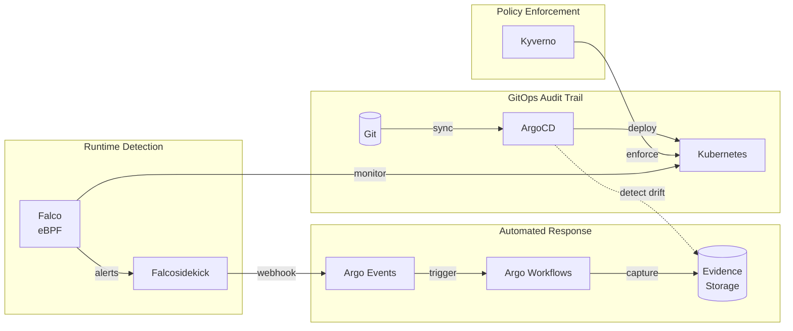

# The Auditor Who Had Nothing Left To Ask

> GitOps and Runtime Security for Sovereign Compliance

[](https://github.com/peopleforrester/auditor-with-no-questions/actions/workflows/ci.yaml)
[](https://opentofu.org/)
[](https://falco.org/)
[](https://argoproj.github.io/cd/)
[](LICENSE)

**Stop scrambling when auditors arrive.** This repo implements continuous compliance evidence using CNCF projects—detecting threats in seconds and capturing forensic evidence before anyone asks for it.

Built for teams facing **NIS2**, **DORA**, and **SOC2** compliance in sovereign and regulated environments.

## What You Get

- **Runtime threat detection** with compliance-tagged Falco rules (eBPF)
- **Immutable audit trails** via ArgoCD GitOps
- **Automated evidence capture** using Argo Workflows
- **Policy enforcement** with Kyverno CEL policies
- **Compliance mappings** for NIS2, DORA, SOC2, MITRE ATT&CK

## Architecture



## Quick Start

```bash
# Clone
git clone https://github.com/peopleforrester/auditor-with-no-questions
cd auditor-with-no-questions

# Deploy infrastructure (requires AWS credentials)
cd infrastructure/terraform
tofu init && tofu apply

# Update kubeconfig
aws eks update-kubeconfig --name sovereign-demo --region eu-central-1

# Bootstrap ArgoCD (deploys everything via GitOps)
kubectl apply -k bootstrap/argocd/
kubectl apply -f bootstrap/app-of-apps/root-app.yaml

# Verify
kubectl get applications -n argocd
```

## Demo Scenarios

| Scenario | Trigger | Detection | Response |
|----------|---------|-----------|----------|
| **Shell Access** | `kubectl exec` into pod | Falco detects in <3s | Alert + evidence capture |
| **Config Drift** | Manual `kubectl edit` | ArgoCD catches | Auto-sync or alert |
| **Crypto Miner** | Deploy malicious workload | Falco behavioral rules | Isolation + forensics |

```bash
# Run a demo
sovereign demo run shell-access
sovereign demo run crypto-miner
```

## Compliance Mapping

Every Falco rule maps to regulatory controls:

| Detection | MITRE ATT&CK | NIS2 | DORA | SOC2 |
|-----------|--------------|------|------|------|
| Terminal shell in container | T1059 | Art. 21(2)(g) | Art. 9(4)(c) | CC6.1 |
| Sensitive file access | T1552 | Art. 21(2)(i) | Art. 9(3)(a) | CC6.1 |
| Crypto mining activity | T1496 | Art. 21(2)(e) | Art. 10(1) | CC7.2 |
| Privilege escalation | T1548 | Art. 21(2)(g) | Art. 9(4)(c) | CC6.2 |
| Non-GitOps modification | T1078 | Art. 21(2)(j) | Art. 9(3)(a) | CC8.1 |

See [COMPLIANCE-MAPPING.md](docs/COMPLIANCE-MAPPING.md) for full details.

## Tech Stack

| Component | Version | Purpose | CNCF Status |
|-----------|---------|---------|-------------|
| ArgoCD | 3.2.4 | GitOps, audit trails | Graduated |
| Falco | 0.42.0 | Runtime security (eBPF) | Graduated |
| Falcosidekick | 2.32.0 | Alert routing | Sandbox |
| Argo Events | 1.9.10 | Event-driven automation | Incubating |
| Argo Workflows | 3.6.0 | Evidence capture | Graduated |
| Kyverno | 1.16.2 | Policy enforcement (CEL) | Incubating |
| OpenTofu | 1.9+ | Infrastructure provisioning | LF Project |

**No vendor lock-in. Runs anywhere Kubernetes runs.**

## Documentation

- [Setup Guide](docs/SETUP.md) - Full deployment walkthrough
- [Demo Runbook](docs/DEMO-RUNBOOK.md) - Step-by-step demo script
- [Compliance Mapping](docs/COMPLIANCE-MAPPING.md) - Rule to control mappings

## About

This repo accompanies the talk **"The Auditor Who Had Nothing Left To Ask"** submitted to Open Sovereign Cloud Day at KubeCon EU 2026 Amsterdam.

**Author:** Michael Forrester ([@peopleforrester](https://github.com/peopleforrester))
**Organization:** KodeKloud (CNCF Training Partner)

## License

Apache 2.0 - See [LICENSE](LICENSE)
