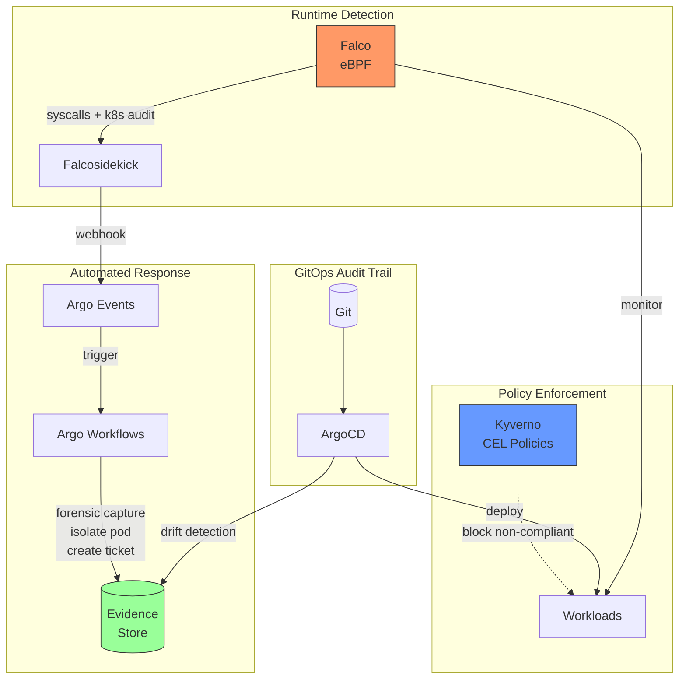

# The Auditor Who Had Nothing Left To Ask

> *"The ability to move the needle without permission is a form of sovereignty."*
> — Kelsey Hightower, Civo Navigate London 2025

[](https://github.com/michaelrishiforrester/auditor-with-no-questions/actions/workflows/ci.yaml)
[](LICENSE)
[](https://python.org)
[](https://opentofu.org/)
[](https://www.cncf.io/projects/)

**Continuous compliance evidence for sovereign Kubernetes using CNCF projects.**

Companion code for **[Open Sovereign Cloud Day](https://events.linuxfoundation.org/kubecon-cloudnativecon-europe/)** at KubeCon EU 2026 Amsterdam.

<!-- Demo GIF: Record 15-30 second clip showing shell-access → detection → evidence -->
<!--  -->

---

## What This Does

An auditor walks into your infrastructure. They expect scattered logs and engineers scrambling. Instead, they find a system that already knows what they'll ask—and is currently detecting issues they haven't thought to check.

This repository demonstrates a production architecture combining:

| Component | Version | Role | CNCF Status |
|-----------|---------|------|-------------|
| **EKS** | 1.33+ | Kubernetes platform | N/A |
| **ArgoCD** | 3.2.4 | GitOps audit trails | Graduated |
| **Falco** | 0.42.0 | Runtime threat detection (eBPF) | Graduated |
| **Falcosidekick** | 2.32.0 | Alert routing | Sandbox |
| **Kyverno** | 1.16.2 | Policy enforcement (CEL-based) | Incubating |
| **Argo Events** | 1.9.10 | Event-driven automation | Incubating |
| **Argo Workflows** | 3.6.0 | Response orchestration | Graduated |

**No vendor lock-in. Runs anywhere Kubernetes runs.**

## Infrastructure as Code

This repo uses [OpenTofu](https://opentofu.org/), the open-source infrastructure-as-code tool under the Linux Foundation. This aligns with our commitment to avoiding vendor lock-in and using truly open-source tooling.

**Terraform users:** OpenTofu is a drop-in replacement. If you prefer Terraform, replace `tofu` with `terraform` in all commands—the `.tf` files are fully compatible.

## Author

**Michael Forrester**
Principal Training Architect & DevOps Advocate

## Quick Start

```bash
# Clone and install
git clone https://github.com/michaelrishiforrester/auditor-with-no-questions.git
cd auditor-with-no-questions

# Python environment (requires 3.11+)
uv venv && source .venv/bin/activate
uv pip install -e .

# Or with pip
python -m venv .venv && source .venv/bin/activate
pip install -e .

# Set up infrastructure and validate
sovereign setup --method eksctl --region eu-central-1
sovereign validate

# Run a demo scenario
sovereign demo run shell-access
```

## CLI Commands

```bash
# Setup
sovereign setup --cluster-name demo --region eu-central-1 --method opentofu

# Validation
sovereign validate              # Check all components
sovereign validate --json       # Output as JSON
sovereign validate --verbose    # Show details

# Demo scenarios
sovereign demo list             # List available scenarios
sovereign demo run shell-access # Run specific scenario
sovereign demo reset            # Clean up for fresh demo

# Evidence export
sovereign evidence export --days 90 --output evidence.zip
sovereign evidence verify evidence.zip
```

## Demo Scenarios

| Scenario | What It Shows | Duration |
|----------|---------------|----------|
| `shell-access` | Falco detects `kubectl exec` with compliance tags | ~30s |
| `drift-detection` | ArgoCD catches non-GitOps changes | ~30s |
| `crypto-miner` | Full response: detect - capture - isolate - ticket | ~45s |
| `evidence-export` | Generate 90-day compliance package | ~15s |

## Architecture



<details>
<summary>ASCII Diagram (for terminals without Mermaid support)</summary>

```
┌─────────────────────────────────────────────────────────────────────────┐
│                      SOVEREIGN COMPLIANCE LAYER                          │
├─────────────────────────────────────────────────────────────────────────┤
│                                                                          │
│   ┌──────────┐      RUNTIME DETECTION       ┌─────────────────────┐    │
│   │  FALCO   │──────────────────────────────│    ALERT STREAM     │    │
│   │  (eBPF)  │   syscalls, k8s audit        │    (evidence)       │    │
│   └──────────┘                              └──────────┬──────────┘    │
│        │                                               │               │
│   ┌────▼─────┐      EVENT ROUTING           ┌─────────▼──────────┐    │
│   │ SIDEKICK │──────────────────────────────│   ARGO EVENTS      │    │
│   └──────────┘                              └──────────┬──────────┘    │
│                                                        │               │
│   ┌──────────┐      AUTOMATED RESPONSE      ┌─────────▼──────────┐    │
│   │  ARGO    │◀─────────────────────────────│   ARGO WORKFLOWS   │    │
│   │   CD     │   capture, isolate, ticket   └────────────────────┘    │
│   └────┬─────┘                                                         │
│        │            POLICY ENFORCEMENT      ┌────────────────────┐    │
│   ┌────▼─────┐                              │      KYVERNO       │    │
│   │   GIT    │   immutable audit trail      │   (CEL policies)   │    │
│   └──────────┘                              └────────────────────┘    │
│                                                                          │
└─────────────────────────────────────────────────────────────────────────┘
```
</details>

## Version Requirements (January 2026)

**Target versions for KubeCon EU 2026 (March 23):**

- **EKS**: 1.34 (standard support until Dec 2026)
- **ArgoCD**: 3.2.4 (breaking changes from 2.x - new RBAC model)
- **Falco**: 0.42.0 with `modern-bpf` driver (CO-RE, kernel 5.8+)
- **Falcosidekick**: 2.31.1 (OTel support)
- **Kyverno**: 1.16.2 with new CEL-based ValidatingPolicy
- **Argo Events**: 1.10.x (currently using 1.9.10 until charted)
- **Argo Workflows**: 3.6.16 (currently using 3.6.0 until charted)

## Compliance Mappings

Every Falco rule includes framework tags that map to specific regulatory controls:

| Falco Rule | MITRE ATT&CK | NIS2 | DORA | SOC2 |
|------------|--------------|------|------|------|
| Terminal Shell in Container | T1059 (Command Execution) | Art. 21 - Access Control | Ch. III - Incident Detection | CC6.1 - Logical Access |
| Sensitive File Access | T1552 (Credential Access) | Art. 21 - Access Control | Ch. II - Data Protection | CC6.1 - Logical Access |
| Crypto Mining Activity | T1496 (Resource Hijacking) | Art. 21 - Threat Detection | Ch. III - Cyber Threat | CC7.2 - System Monitoring |
| Privilege Escalation Attempt | T1548 (Privilege Escalation) | Art. 21 - Access Control | Ch. II - Security Control | CC6.1 - Logical Access |
| Non-GitOps Modification | T1078 (Valid Accounts) | Art. 21 - Change Management | Ch. III - Change Control | CC8.1 - Change Management |

### Tag Format in Rules

```yaml
tags:
  - mitre_execution      # MITRE ATT&CK T1059
  - NIS2_access_control  # NIS2 Article 21
  - DORA_incident_detection  # DORA Chapter III
  - SOC2_CC6.1          # SOC2 Logical Access
```

This enables filtering evidence exports by framework (e.g., `sovereign evidence export --framework NIS2`).

## Project Structure

```
├── src/                      # Python CLI and automation
│   ├── cli.py                # Main CLI entry point
│   ├── validate.py           # Health checks
│   ├── demo.py               # Demo orchestration
│   └── evidence.py           # Evidence export
├── infrastructure/           # OpenTofu + eksctl
├── bootstrap/                # ArgoCD 3.2 installation
├── apps/                     # All managed applications
│   ├── falco/                # Detection + rules
│   ├── kyverno/              # CEL-based policies
│   └── argo-*/               # Events + Workflows
├── demo/                     # Demo scenarios
└── presentation/             # Slides and backup videos
```

## Contributing

Contributions welcome! See [CONTRIBUTING.md](CONTRIBUTING.md).

## License

Apache 2.0 - See [LICENSE](LICENSE)

## Security

For security concerns, see [SECURITY.md](SECURITY.md)

---

**The auditor had nothing left to ask. Now you have everything you need to build this.**
