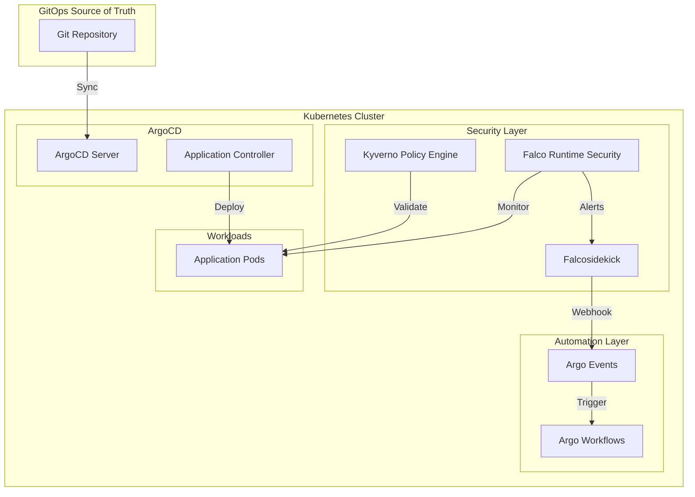
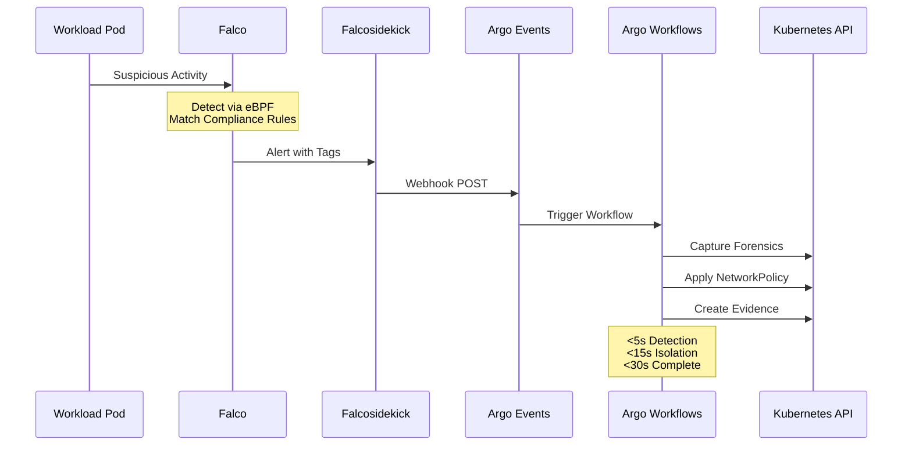
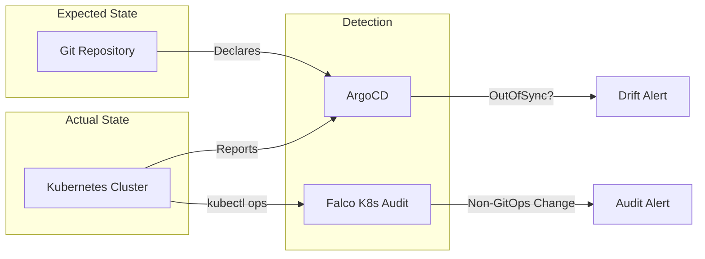
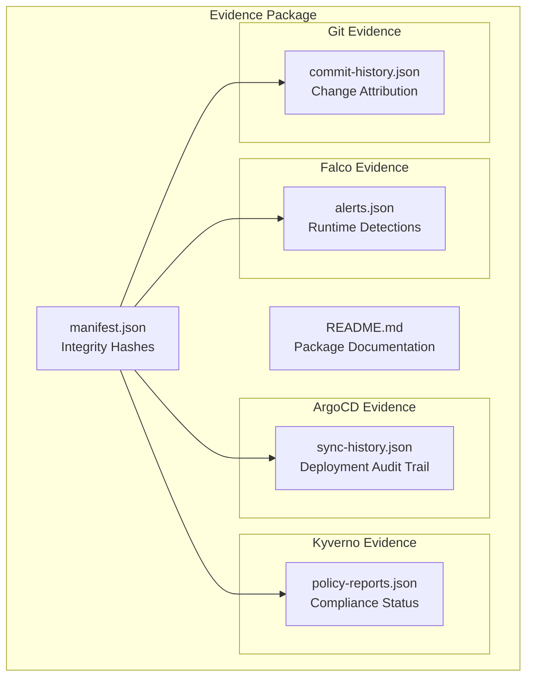
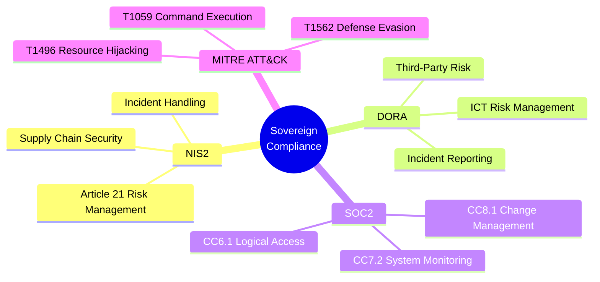
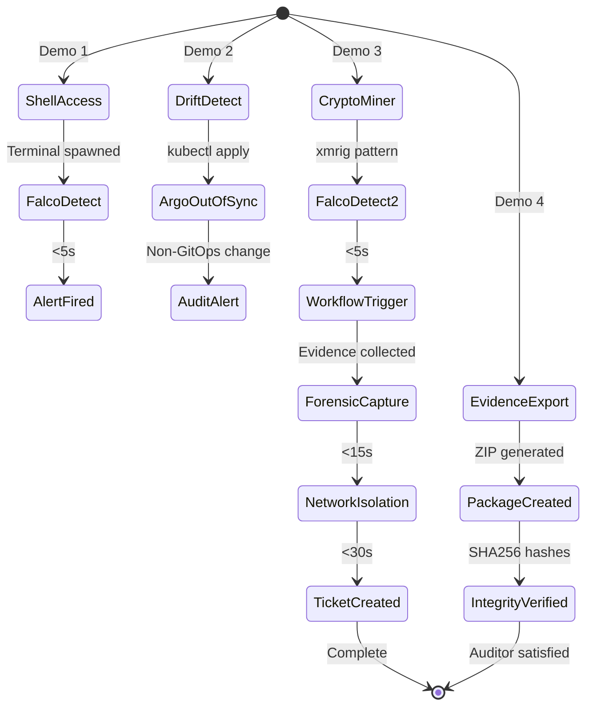

# ABOUTME: Architecture diagrams for Sovereign Compliance presentation
# ABOUTME: Mermaid diagrams showing GitOps compliance automation

# Sovereign Compliance Architecture

## System Overview

## Compliance Response Chain

## GitOps Drift Detection

## App-of-Apps Sync Waves

```mermaid
gantt
    title ArgoCD Sync Wave Deployment
    dateFormat X
    axisFormat %s

    section Wave 0
    Namespaces           :a1, 0, 1

    section Wave 1
    ArgoCD               :a2, 1, 2

    section Wave 2
    Monitoring           :a3, 2, 3
    Falco                :a4, 2, 3
    Falcosidekick        :a5, 2, 3

    section Wave 3
    Kyverno              :a6, 3, 4

    section Wave 4
    Argo Events          :a7, 4, 5
    Argo Workflows       :a8, 4, 5

    section Wave 5
    Demo Application     :a9, 5, 6
```

## Evidence Package Structure

## Compliance Framework Mapping

## Demo Scenario Flow

